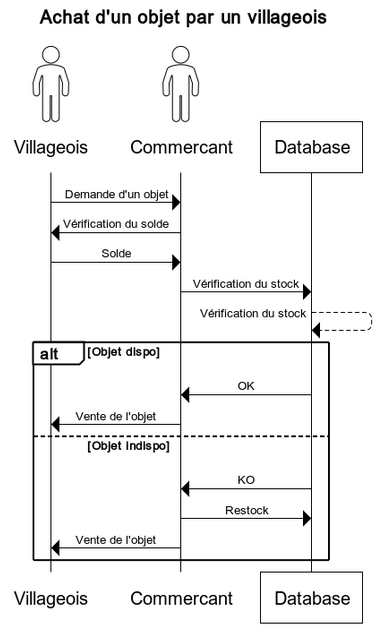
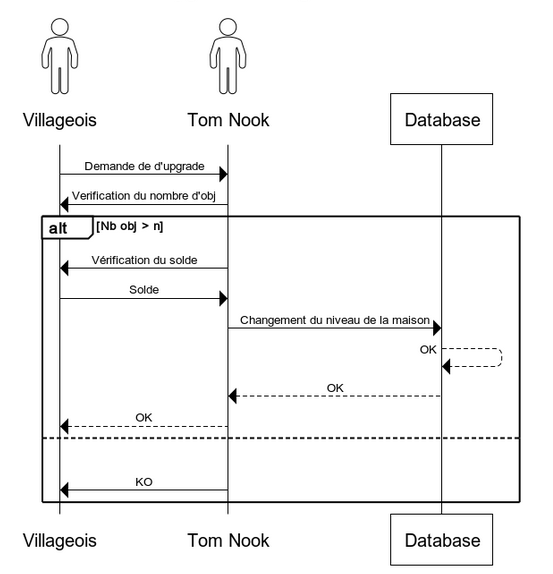
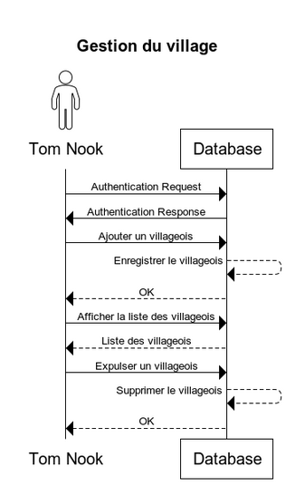
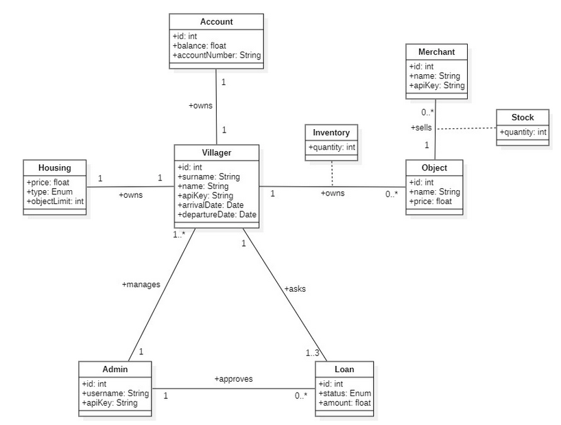

# Acteurs

- Tom Nook, le maire
- Les habitants
- Les commerçants

# Objectifs du système à modéliser

On propose de modéliser un système de gestion de village permettant à ses habitants de communiquer directement avec le maire (Tom Nook) et d’effectuer des achats pour améliorer leur habitat. 

Le projet inclus :

Service de gestion des villageois
Service de gestion des logements
Service de gestion des stocks
Service de gestion des pensions
Service de gestion des prêts

Exigences fonctionnelles :

VILLAGEOIS 
Un villageois possède un logement
Un villageois peut upgrade son logement
Un villageois possède un compte bancaire
Un villageois peut consulter son solde
Un villageois peut effectuer une demande prêt
Un villageois peut acheter des objets de décorations
Un villageois possède des critères de préférences sur les objets

COMMERÇANTS 
Un commerçant peut vendre des objets de décorations
Un commerçant peut produire des objets
Un commerçant peut consulter la liste des objets produits

TOM NOOK
Tom Nook peut accorder un prêt
Tom Nook peut valider l’upgrade d’une maison
Tom Nook peut ajouter un nouveau villageois
Tom Nook peut expulser un villageois
Tom Nook peut consulter la liste des villageois

LOGEMENT
Un logement peut être une tente, un appartement ou une maison
Un logement possède un nombre maximum d’objet
Un logement possède un prix

Règles métier :

Un villageois ne peut pas upgrade son logement si celui-ci ne possède pas le nombre d’objet maximum
Un villageois ne peut avoir qu’un seul logement
Un logement ne peut pas être mis à niveau s’il ne contient pas le maximum d’objet
Le logement par défaut d’un habitant est une tente
Un villageois ne peut plus acheter d’objets si son logement atteint le maximum d’objet autorisé 

