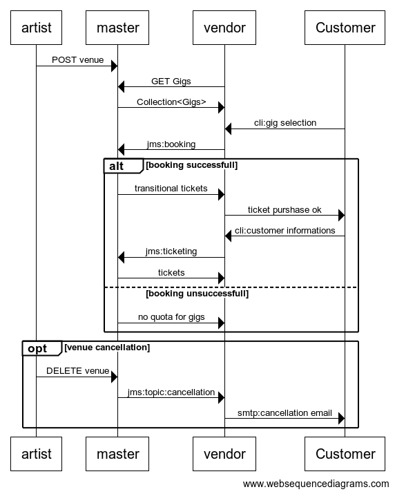
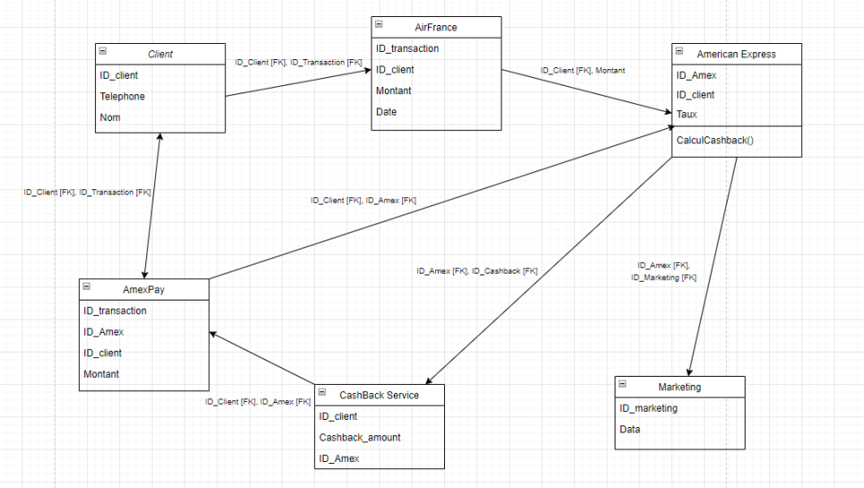

## Objectifs du système à modéliser

On propose de modéliser un système de réservation (master) de tickets pouvant supporter plusieurs vendeurs (vendor). Le système master gère les salles, les concerts, les différents artistes se produisant dans les concerts et la réservation des tickets alors que les vendeurs assurent la vente de billets. Chaque vendeur a un quota pour un concert donné, qui peut évoluer avec le temps.
En cas d'annulation de concert, le système de réservation informe les vendors qui doivent contacter les clients (customers). Le master propose des services de validation de l'authenticité des tickets à l'entrée des concerts.

Lors de la réservation de ticket, on a 2 phases:
- le booking (réservation des places)
- le ticketing (émission de billets sécurisés avec clé.)

Le vendor va demander au master via une API rest les concerts pour lesquels il possède un quota. Seuls ces concerts seront proposés à la vente au client.
Le client spécifie ensuite le nombre de places assises et le nombre de places debout qu'il souhaite acheter. Le vendor interroge le master sur la disponibilité. Celui-ci va lui renvoyer des tickets transitionnels valables 10 minutes en cas de disponibilité de places.
Le vendeur va ensuite renseigner les informations du client et les transmettre au master pour l'émission finale des tickets avec clé sécurisée qui sera transmise au client pour qu'il puisse entrer dans la salle.
En cas d'annulation du concert, le master prévient les vendors (avec les informations des tickets à annuler et les emails des clients) le vendeur doit envoyer un email au client pour chaque ticket annulé.

## Interfaces

```
artist->master: POST venue
vendor->master: GET Gigs
master->vendor: Collection<Gigs>

Customer->vendor: cli:gig selection

vendor->master: jms:booking
alt booking successfull
    master->vendor: transitional tickets
    vendor->Customer: ticket purshase ok
    Customer->vendor: cli:customer informations
    
    vendor->master: jms:ticketing
    master->vendor: tickets

else booking unsuccessfull
    master->vendor: no quota for gigs
end

opt venue cancellation
    artist->master: DELETE venue
    master->vendor: jms:topic:cancellation
    vendor->Customer: smtp:cancellation email
end
```


## Schéma relationnel



## Exigences fonctionnelles

* le vendor NE DOIT proposer que les concerts pour lesquels il a un quota disponible, transmis par le master.
* le vendor DOIT pouvoir effectuer les opérations de booking et ticketing
* le master DOIT permettre à l'artiste d'annuler son concert.
* le master DOIT informer le vendor en cas d'annulation de concert
* le vendor DOIT informer les clients de l'annulation du concert par mail
* le master DOIT proposer un service de validation de la clé du ticket, pour les contrôles aux entées.

## Exigences non fonctionnelles

* le booking et le ticketing, bien qu'étant des opérations synchrones, DOIVENT être fiables et donc utiliser le messaging
* Lors de l'annulation de tickets, le master DOIT informer tous les vendors de l'annulation, de façon fiable.