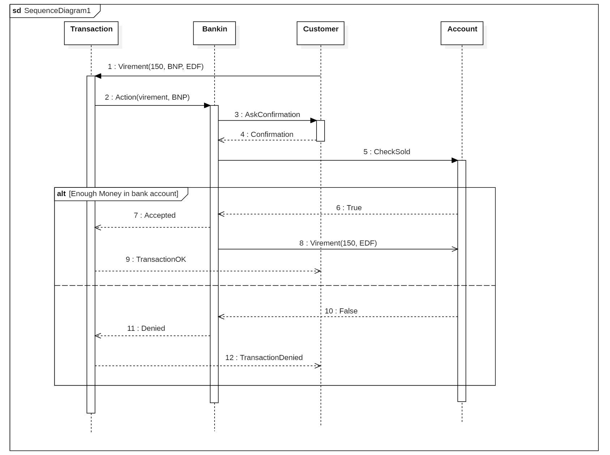

## Objectifs du système à modéliser : Bankin

Nous proposons de modéliser un système (bankin) d’agrégation de comptes bancaires (account) provenant de différentes banques (bank). Chaque banque fait partie d’un groupe (bankGroup) et chaque groupe de banque dispose du même format de données.

Le système bankin gère les comptes et les dépenses que l’utilisateur (customer) souhaiterait effectuer via sa banque. Lors de la synchronisation entre bankin et les différents comptes bancaires, les banques devront confirmer avec l’utilisateur son autorisation pour que le système puisse accéder à ses données.

Le système sera capable d’optimiser les dépenses de l’utilisateur en comparant le montant de ses dépenses, avec le prix du marché afin de proposer le montant le plus avantageux.

## Use Case

- Use Case 1 : Synchroniser les comptes (il récupère les comptes en banque transactions des utilisateurs)
Il y a des regroupements de banques (BPCE...). Les regroupements de banques peuvent avoir des formats différents (JSON, ...).

- Use Case 2 : Autorisation (double facteur) pour récupérer les comptes, l'utilisateur entre ses identifiants et indique à la banque qu'il souhaite synchroniser les comptes (recevoir une notification de la banque et saisir les informations).

- Use Case 3 : Alerte quand il y a une transaction suspecte -> voir en groupe ce qui peut être une transaction suspecte (envoyer un mail à l'utilisateur pour le prévenir de la transaction).

- Use Case 4 : Analyse des dépenses et optimisation -> L'idée est d'examiner toutes les dépenses et de proposer des solutions d'optimisation pour chacun des comptes.

## Interfaces

## Exigences fonctionnelles

* Bankin DOIT avoir l’autorisation de la banque (bank) pour pouvoir agréger le compte du client
* L’utilisateur DOIT confirmer à sa banque que bankin peut accéder à ses comptes
* Bankin DOIT informer le client (customer) en cas de transaction suspecte par mail
* Bankin DOIT permettre à l’utilisateur d’effectuer des transactions sans passer par celle de sa banque
* Bankin DOIT proposer à l’utilisateur de souscrire à d’autres offres pour réduire ses dépenses

## Exigences non fonctionnelles

* Les banques d’un même groupe DOIVENT avoir le même format de données 
* Bankin DOIT informer le client (customer) en cas de transaction suspecte par mail
