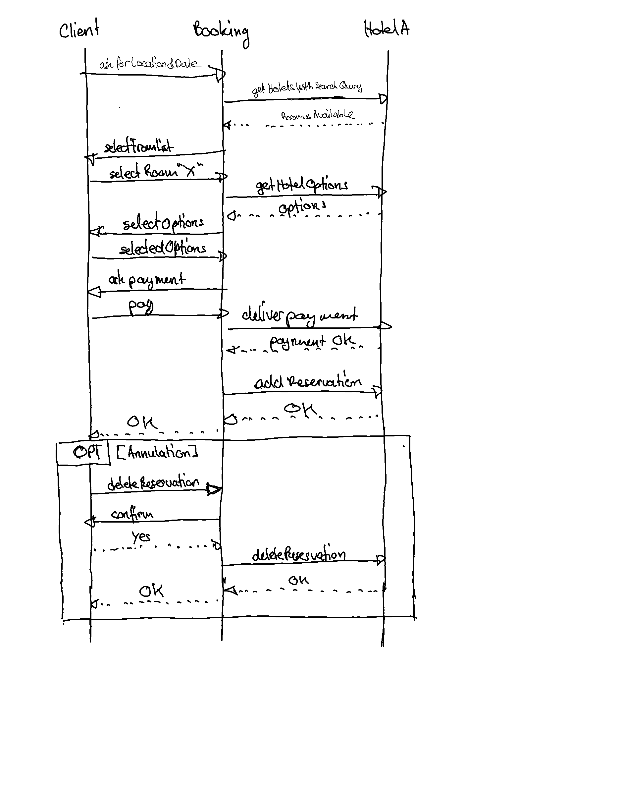
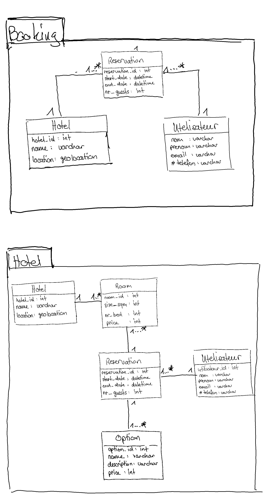

## Objectifs du système à modéliser

On propose de modéliser un système de réservation d'hotellerie (Booking.com) pouvant supporter plusieurs hotels. Le système Booking gère les hotels, réservations et les utilisateurs (une réservation concerne un utilisateur et un hotel). Chaque hotel (bdd de l'hotel) à une adresse, chambres, options specials, réservations, utilisateurs.
Chaque chambre a une capacité maximale et prix (possiblité d'ajouté un sys de paiment/ simuler un paiment).
### Cas Normal 
Une fois arrivée sur la plateform, l'utilisateurs fait une recheche d'hotels soit en précisant la ville et les dates et nombres de personnes(champs obj).
L'application renvoit une liste de chambres d'hotels qui sont disponible pour la période choisie. L'utilisateur choisi la chambre qui lui convient le plus avec ou sans option special, et fais sa réservation.
Une fois la réservation est confirmée un email de confirmation lui sera envoyé.

Lors de la réservation d'une chambre, on a 2 phases:
- le booking (réservation des chambres)
- la confirmation (émission d'email avec recap).
- 
### Annulation de réservation 
En cas d'annulation de réservation, L'utilisateur fais une demande d'annulation de sa resérvation (sous contrainte quelle existe) sur Booking. le système de réservation informe l'hotel concerné que la réservation vient d'etre annulée (requete rest)
    (2 cas possible : 1 annulation avant 48H de la date de début => rembourssement complet et un email de confirmation que la réservation a été annulée.
                    : 2 annulation après 48H de la date de début => rembourssement de 75% et un email de confirmation que la réservation a été annulée.)
                    
---(possiblité de changement de date)---

## Interfaces

## Schéma relationnel

## Exigences fonctionnelles

* le systeme (Booking) NE DOIT proposer que les chambres d'hotel disponible et qui satisfait les criteres de recherche de l'utilisateur.
* le systeme DOIT pouvoir effectuer des opérations de reservation.
* le systeme DOIT pouvoir informé l'utilisateur de la confirmation de sa réservation par mail
* le systeme DOIT permettre à l'utilisateur d'annuler sa réservation.
* le systeme DOIT informer l'hotel en cas d'annulation de réservation.
* le systeme DOIT informer l'utilisateur de l'annulation de la reservation par mail
* enrichir le prix envoyer par lhotel (benef)
* une fois qu'un utilisateur a choisie une un hotel (les chambres de ce derniers seront indisponible pour une durée aux autres utilisateurs)

## Exigences non fonctionnelles

* le reservation, bien qu'étant une opération synchrones, DOIT être fiable et donc utiliser le messaging
* Lors de l'annulation de reservation, le systeme DOIT informer l'hotel de l'annulation de réservation, de façon fiable.
