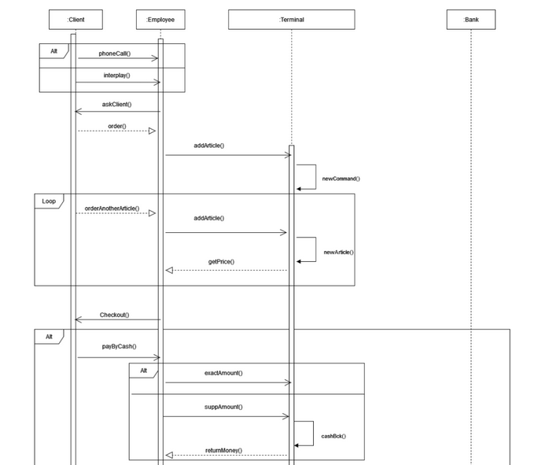
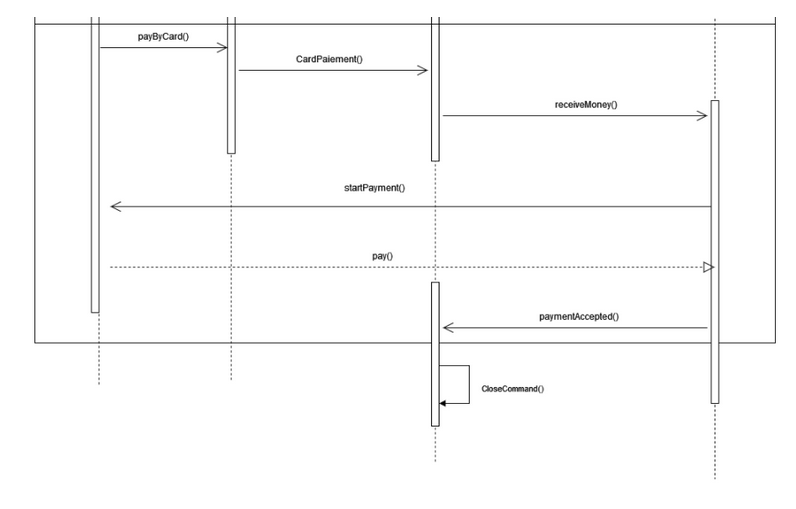
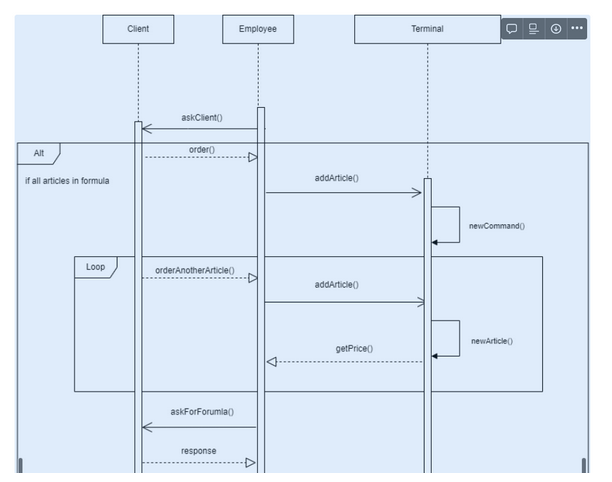
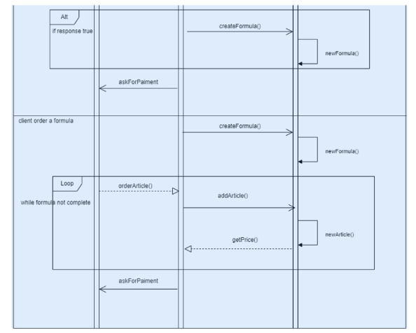

employé (server REST, pas de DB, push des messages jms)
caisse (recois des messages JMS, envoie à la banque et au programme de fidélité) DB
bank (recois des messages JMS, envoie JMS) DB
fidélité (recois des messages JMS ) DB

------------

# Système à modéliser
un système de caisse ( préparation d’un commande ) utilisé par les employés d’une chaîne de restauration.

# DESCRIPTION DU SYSTEME

On souhaite faciliter les échanges entre client et vendeur dans la restauration.
Pour ce faire nous allons modéliser une interface pour les employés en prenant exemple de la chaine de restauration “Brioche dorée”.
Tous d’abord on choisit le type de commande “Sur place “ ou “Emporté”.
Puis on a direct accès à tout les produits. Pour faciliter, tout les produits sont classées selon leur genre ( traiteur, viennoiserie, dessert, sandwich, salade …)
A chaque fois qu’on ajoute un produit, on a accès à la commande en cours. ( avec possibilité de effacer la dernière ligne ou un ligne en particulier)
Un système de formule est également mis en place (avec des formules disponibles seulement le matin ) on peux entrer les formules de 2 manières:
directement via la partie formule : ici on choisi notre formule puis l’interface nous affiche 1 à 1 les produits compris dedans ( ex: formule sandwich → choisir sandwich → choisir dessert → choisir boisson ( avec 0,50€ de supplément pour les boissons )
Une option “Appliquer formule” est disponible avec d’un coté tout les produits de la commande et de l’autre toutes les formules possibles, on sélectionne les produits puis on choisis la formule associée ci elle existe
En allant sur finaliser, on aura accès à la commande avec la possibilité de payer en espèce et carte bleu.
Une fois la commande terminée, on l’enregistre dans la bdd.
Au niveau des comptes , dans la caisse il y aura 2 types de compte ( compte employé et compte responsable.
Responsable :On a la possibilité d’avoir accès à toutes les commandes effectué avec comme caractéristique : Date de la commande, montant, nom de l’employé, nom du client ( si carte de fidélité scanné ), n°ticket.
Système de fidélité : les clients peuvent avoir une carte de fidélité gratuite, ils auront seulement à l’activer puis la scanner à chaque passage. Les avantages sont les suivants :
1€ d’achat correspond à 10points
300points : -10%

# UPDATE :

## ACTEURS : Client - Serveur - Caisse - Gestion Fidélité - Banque

## Exigences :
- Un client doit pouvoir utiliser sa carte de fidélité et appliquer des réductions. ( 300 points → -10% )
- Le client doit pouvoir payer
- La gestion de fidélité permet de cumuler des points à chaque commande en fonction du montant de celle-ci ( 1€ = 10 points )
- Le serveur peut annuler une commande
- Le serveur peut modifier (ajouter/retirer des produits) une commande tant qu’elle n’es pas confirmé.
- La caisse peut imprimer un TICKET DE CAISSE
- La caisse doit afficher le total lors de la commande
- “La caisse doit permettre de modifier le prix d’un produit, ainsi que sa quantité”
- La caisse doit pouvoir appliquer des formules/menu ( automatiquement )
- Dans le cas ou plusieurs formules à prix différents prendre la formule qui avantage le client.
- La caisse doit pouvoir appliquer des suppléments
- La banque peux refuser ou accepter la transaction avec la commande.
- Une commande terminée doit être enemployé (server REST, pas de DB, push des messages jms)
- caisse (recois des messages JMS, envoie à la banque et au programme de fidélité) DB
- bank (recois des messages JMS, envoie JMS) DB
- fidélité (recois des messages JMS ) DB

## Diagramme de séquence

Le terminal renvoie l’order_Id après l’ajout du premier article pour ajouter les articles suivant dans la bonne commande

Le programme de fidélité augmente les points après la confirmation du paiement par la Banque

1€ = 10pts

300pts = -10% sur le total de la commande

# Organisation des projets

3 projets différents
Banque
Terminal
Fidélité

Chaque projet a sa propre bdd

